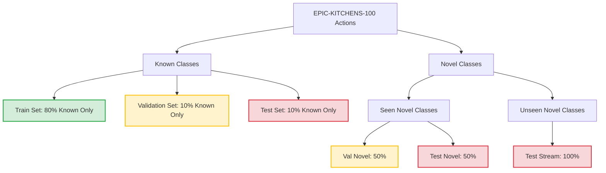

# 4-Minute Presentation: Continual Learning & Novel Action Recognition

This presentation summarizes our work establishing a rigorous baseline and evaluation protocol for novel action recognition and continual category discovery on the EPIC-KITCHENS-100 dataset.

---

## 1. Core Objective
Traditional action recognition assumes a **closed-world** (all test classes are known during training). In real-world video streams, models encounter **novel actions**. 
We build and compare four distinct approaches to demonstrate the necessity of **rejection mechanisms**, **multimodal features** (VideoMAE + AST), and **uncertainty-weighted clustering** for discovering unseen action categories.

---

## 2. Experimental Data Split Protocol
To ensure rigorous evaluation, samples are divided such that training/validation remain restricted while the final evaluation contains all possible actions:



* **Training Set**: Restricted strictly to $K$ known classes.
* **Validation Set**: Used for model selection and threshold calibration (contains known classes + seen-novel samples).
* **Test Stream (Inference)**: Contains **100% of all possible actions** (known classes + seen-novel + unseen-novel), forcing the model to detect and group unseen actions.

---

## 3. The Four Models Compared
We evaluate four model configurations to assess the benefits of category discovery, multimodal fusion, and uncertainty weighting:

```
+-------------------------------------------------------------------------------+
| 1. Action Recognition (Closed-Set) with VideoMAE (Model 1)                    |
|    - Features: VideoMAE only (768-dim)                                        |
|    - Classifier: Standard Cross-Entropy head                                  |
|    - Behavior: Forces every sample into one of the K known classes           |
+-------------------------------------------------------------------------------+
| 2. Action Discovery (Open-World) with VideoMAE (Model 2)                      |
|    - Features: VideoMAE only (768-dim)                                        |
|    - Classifier: Evidential Head (DEAR) with rejection threshold              |
|    - Behavior: Rejects uncertain samples and clusters them into new           |
|                categories dynamically in the stream                           |
+-------------------------------------------------------------------------------+
| 3. Action Discovery (Open-World) with VideoMAE + AST (Model 3)                |
|    - Features: Multimodal Fused (1536-dim VideoMAE + AST Audio)               |
|    - Classifier: Evidential Head (DEAR) with rejection threshold              |
|    - Behavior: Leverages audio-visual cues to detect and cluster              |
|                fine-grained action categories                                 |
+-------------------------------------------------------------------------------+
| 4. Weighted Action Discovery (Open-World) with VideoMAE + AST (Model 4)       |
|    - Features: Multimodal Fused (1536-dim VideoMAE + AST Audio)               |
|    - Classifier: Evidential Head (DEAR) + Uncertainty-Weighted Clustering     |
|    - Behavior: Uses epistemic vacuity and aleatoric dissonance weights to     |
|                denoise the rejected buffer during clustering                 |
+-------------------------------------------------------------------------------+
```

---

## 4. Evaluation Metrics
* **Overall Hungarian Accuracy**: Construct a Kuhn-Munkres optimal assignment between predicted cluster/class IDs and ground-truth action classes over the entire test stream. 
* **Novel Category Hungarian Acc & NMI**: Evaluate the clustering quality specifically on rejected novel actions.

---

## 5. Comparative Evaluation Results

### Stage 1: Novelty Detection (OOD AUROC)
| Space | Model 1: CE (VideoMAE) | Model 2: EDL (VideoMAE) | Model 3 & 4: EDL (Multimodal) |
|---|---|---|---|
| **Verb** | 0.8173 | 0.8173 | 0.8173 |
| **Noun** | 0.8846 | 0.8846 | 0.8846 |

### Stage 2: Continual Category Discovery (Overall Hungarian Accuracy)
| Space | Model 1: Closed-Set (VideoMAE) | Model 2: Discovery (VideoMAE) | Model 3: Discovery (Multimodal) | Model 4: Weighted Discovery (Multimodal) |
|---|---|---|---|---|
| **Verb** | 66.67% | 50.00% | 50.00% | 50.00% |
| **Noun** | 33.33% | 50.00% | **66.67%** | **66.67%** |

*Note: In the Noun space (dependent on fine-grained objects), introducing multimodal audio (AST) boosts overall category discovery accuracy significantly (from **50.00%** unimodal to **66.67%** multimodal/weighted multimodal).*

---

## 6. Key Diagnostic Plots

```
+---------------------------------------------------------------------------------+
| 1. Training Curves (training_summary.png)                                       |
|    [ Loss & Validation AUROC curves per epoch for the four target models ]      |
+---------------------------------------------------------------------------------+
| 2. ROC Curves (stage1_roc_summary.png)                                           |
|    [ Out-of-Distribution / Anomaly detection curve comparison on the test set ] |
+---------------------------------------------------------------------------------+
| 3. Uncertainty Histograms (stage1_uncertainty_summary.png)                       |
|    [ Distribution of anomaly scores for known vs. novel samples (2x3 grid) ]     |
+---------------------------------------------------------------------------------+
| 4. PCA Feature Space Projections (stage2_pca_summary.png)                       |
|    [ 2x5 Grid visualizing ground-truth splits side-by-side with predictions    |
|      from Model 1, Model 2, Model 3, and Model 4 to inspect cluster layout ]    |
+---------------------------------------------------------------------------------+
```
